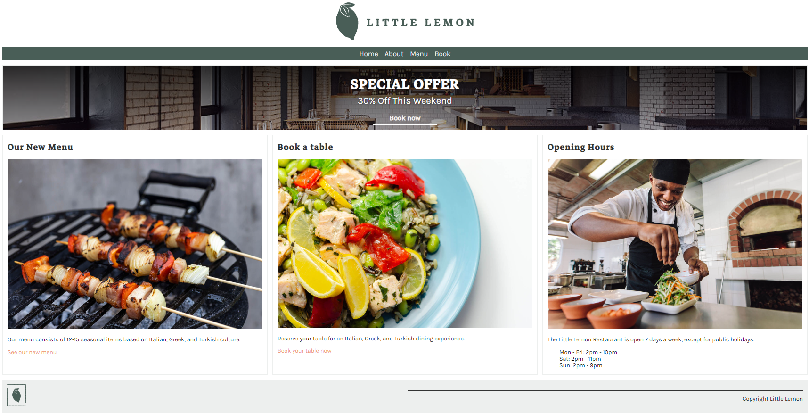

# Little Lemon Restaurant

The Little Lemon Restaurant, is a robust Django backend designed to power the Little Lemon app as the final capstone project for the Meta Django Web Framework program on Coursera.



### Menu Item
Discover the details of each menu item through dedicated pages dynamically generated from the database. Get a closer look at the flavors, prices, and descriptions of your favorite dishes.

**Name**: Identify each dish by its unique name.<br>
**Price**: Know the cost of each menu item.<br>
**Description**: Delve into the flavors with a detailed description.<br>
**Image**: Visualize the culinary delights through mouth-watering images.<br>


## Installation
Clone the repository
<br>
``` git clone git@github.com:mehdiaitouchrif/little-lemon-backend.git ```
<br>
Create a virtual environment and activate it
<br>
``` python3 -m venv env ```
<br>
``` source env/bin/activate ```
<br>
Install the dependencies
<br>
``` pip install -r requirements.txt ```
<br>
Run the server
<br>
``` python manage.py runserver ```